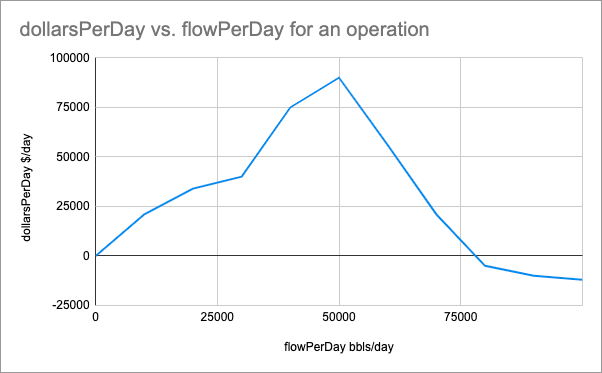

## EOG wells are constantly producing water and we need to find ways to reduce expenditures, as well as reuse and recycle water whenever possible. Your challenge is to use your creativity to develop an application which can process a steady stream of real-time sensor data to both optimize and visualize the distribution of water for our upstream operations! A prize will be awarded to the best team for this category, please come and see the EOG Resources team for more details.

EOG is called an Oil Company, but in a sense we are a water company.  Frequently our wells produce over 4 times as much water as oil per barrel of fluid  (1 bbl = 42 US Gallons).  Managing this water is challenging logistical problem for our industry that requires real time data analysis and tweaks to keep operations flowing.  We pride ourselves on our water reuse programs which allows us to recycle water that we produce to support operations as opposed to using valuable freshwater from nearby ecosystems.

Consider the following: The revenue structure of an operation is not a fixed amount, there are times in which the demand for water increases.  Likewise surplus water beyond a certain point can have diminishing returns.  The points between points on these demand curves should be linearly interpolated.

## Server Data

### Input

The server will send you:

```js
interface ServerRequest {
	flowRateIn:  number;
	operations: WaterOperation[];
	type:  "CURRENT_STATE";
}
```
 - flowRateIn
   - the amount of water flowing into the system
  - operations
    - a list of operations that can use this water
  - type
    - helps you identify the type of message from the server (there are multiple)


The value structure of an operation is defined as an array of points that define the revenue curve for the operation.


```js
interface WaterOperation {
	name:  string,
	id:  string,
	revenueStructure: Point[],
}
```

```js
interface Point {
	flowPerDay:  number,
	dollarsPerDay:  number,
}
```

 ### Output
The server expects the following messages to be sent over the socket connection:

 - An array of the following response(s) from your client:

```js
interface ClientResponse {
	operationId:  string,
	flowRate:  number,
}
```
 - operationId
   - corresponds to an operation from the ServerRequest
 - flowRate
   - the amount of flow allocated to the operation

and will return the following ServerResponse:

```js
interface ServerResponse {
	incrementalValue:  number,
	valuePerDay:  number,
	flowIn:  number,
	totalFlowToOperations:  number,
	type:  "OPTIMATION_RESULT",
}
```
- incrementalRevenue
   - the revenue generated during the last 5 seconds
 - revenuePerDay
   - the Revenue per day at that moment in time.
 - flowIn
   - the flow rate into the system in bbls/day
  - totalFlowToOperations
    - the flow rate out of the system into the operations in bbls/day

## Food for Thought:

 - Data will be streaming in as real time data point
 - A new data point is generated from sensors in the field every 5 seconds.
 - How much water should each location receive?
 - What other kinds of information can you garner from this data?
 - What information would a user of your app want to see?

## Example Project
We hosted an example app here: https://2021-utd-hackathon.azurewebsites.net

You can see the React source code in the "client" folder. It's mainly to give you access to working boilerplate so you can focus on the important stuff. Also the server is open-source if you are curious how it works.

You can start the client by installing node, and then going to the folder and running:
```
yarn install
yarn start
```

You are of course welcome to you use any technology stack and platform you want (But we love great user experiences!)

For python, you can look into this stackoverflow about web sockets. https://stackoverflow.com/questions/3142705/is-there-a-websocket-client-implemented-for-python


## Prizes

The team with the best project will win five Oculus Quest Headsets.

## Bonus!

EOG frequently uses pits to store water. That way we can fill the pit up when the need for water is low and deplete reserves when the need for water is high. Help us determine what the optimal pit size might be for this operation and adjust your algorithm for managing water when a pit exists.

You can initialize a pit by messaging the server with the payload { setPitCapacity: number } on initialization of the socket.

ex:
```js
ws.addEventListener('open',  ()  =>  {
	ws.send(JSON.stringify({setPitCapacity:  100000}));
})
```
Good Luck!


## _example mystery file

Problem Statement

EOG wells are producing natural gas and sending it to a compressor station via pipeline. From there, the gas is sent to several different points of sale each with different prices. For example, some points of sale will offer a higher price if you sell more gas because of economies of scale. While others will offer a high price for a small amount of gas, but will offer a very low price for more gas as it reaches capacity. Based on these prices, EOG is constantly changing how gas is distributed to the different points of sale to sell the gas at the highest average price possible.

    Your job is to build a user interface showing relevant data for someone monitoring this optimization process. This can include things like a chart of total revenue or logs of each time EOG changes the gas distribution.

    For extra credit, you can optimize how gas is allocated to the points of sale to maximize revenue (the algorithm in the starter code just naively distributes gas evenly to all points of sale).

schematic
User Interface Expectations

We really want this to be an opportunity for you to be creative while also making a user interface that is genuinely useful and intuitive to a real user. However, for the sake of making a concrete requirement, we want atleast one component that displays real time information. But keep in mind the more effort you put in, the more evidence we have of your React skills. Here are some ideas for components to put in the app:

    A list of logs for every time EOG changes how gas is distributed
    A chart showing total revenue over time
    Charts showing the points' of sale price structures
    A schematic representation (think SVG) of the points of sale
    Some sort of interactive component for showing how the optimization is done
    Something we never thought of is a huge bonus!

Optimization Algorithm Expectations

For bonus points you can improve how EOG distributes gas. The algorithm in the starter code distributes gas very naively and can be improved upon. This is entirely optional but will definitely impress us if you do it well. More information on the technical details of the optimization can be seen below.
Requirements

    The code should compile and run.
    As data streams from the server, valid responses must be sent back. The template app already implements this (naively), so this is already done!
    The user interface must implemented with React. Besides that, the choice of technologies is up to you!

How it's graded

    Imagine a real person trying to monitor your app. The user interface should be look good, be intuitive, and display data a real user would want to see. Bonus points for creativity!
    Handle edge cases like error conditions, memory leaks, and resizing the browser window.
    Code shoud be consistently linted, have consistent conventions, and generally be easy to understand.
    Proper use of typescript is preferred over javascript.
    Avoid console errors and warnings
    It's not required but we would love to see the optimization algorithm be improved.

Technical Details

A websocket will stream a live feed data. This data includes a list of compressors with their pricing structure and the volume of gas in MCF (thousand cubic feet) coming from the compressor station.

Here is an example sales point.

{
  "name": "Station 1",
  "id": "001",
  "prices": [
    {
      "price": 1.50,
      "amount": 100000,
    },
    {
      "price": 1.75,
      "amount": 150000,
    },
    {
      "price": 2.00,
      "amount": 200000,
    },
    {
      "price": 2.00,
      "amount": 300000,
    },
    {
      "price": 1.00,
      "amount": 350000,
    },
    {
      "price": 0.50,
      "amount": 400000,
    },
  ]
}

And here is what the chart of that data looks like:

Chart

A few things to note.

    Prices are in $/MCF. For example if you send 400,000 MCF of gas to Station 1, you will get paid $200,000.
    Prices are linearly interpolated. For example, 325,000 MCF will sell for $1.50 / MCF.
    There is an implied data point at (0, 0). For example, 10,000 MCF will sell for $0.15 / MCF.
    "amounts" are sorted smallest to largest. And if you distribute more gas than the largest "amount", you will get the last price. For example, 500,000 MCF will sell for $0.50 / MCF.

Here is an example response.

[
  {
    "salesPointId": "001",
    "percent": 100,
  }
]

Since there is only one sales point, the optimal (and only) solution is the allocate 100% of the gas to Station 1.